# Meeting Manager Demo

## Description

This is an assignment project of Software Engineering developed by Yun-Zhong Qiu, Zhi-Bin Jian,Jian-Feng Wu, Zi-Tao Tang, and Di-Chu Wu.
The project is constructed and developed for technical identification and academic 
communication, which is non-profit. During the project development, we took advice from website blogs, experienced developers and outstanding technical documents, providing us a lot of help.

The content of project is about a meeting managing system, which provide simple functions of meeting online registration and scheduling. Such functions are very common on GitHub nowadays, our work is not original. To be honest, we just want to practice our coding capability on Web Apps.

Due to the limitation of ability and resource, the current project is certainly far from perfect. **We are looking forward for your advices!**

## Environment

### Hardware
Please use Windows version **upper-than Windows7**. Other platforms are not tested.

### Software

Please use **Python==3.7**, here is a installing tutorial for installing it:

https://www.cnblogs.com/telwanggs/p/10043142.html


Please use **MySQL==5.7**, here is a installing tutorial for installing it:

https://www.cnblogs.com/7q4w1e/p/9989129.html


Python package managing tools like **Anaconda3** is recommended!


## How to run this project

### Initialization

#### Database

After installing MySQL, use the commands below **in MySQL** to create database and authorize:

```mysql
CREATE DATABASE huiyi DEFAULT CHARACTER SET utf8 collate utf8_general_ci;
CREATE USER 'huiyi '@'%' IDENTIFIED BY '123456';
GRANT ALL PRIVILEGES ON huiyi.* TO 'huiyi '@'%' WITH GRANT OPTION;
ALTER USER 'huiyi '@'%' IDENTIFIED BY '123456' PASSWORD EXPIRE NEVER; 
ALTER USER 'huiyi '@'%' IDENTIFIED WITH mysql_native_password BY '123456';
FLUSH PRIVILEGES;
```

Then, open **Command Prompt** and use the commands below to sign in database and load data:

```sql
use huiyi
source huiyi.sql
```

In the project files, you can find a file named **settings.py**, in which we defined a structure **DATABASES** as a configure path of database. We use the following configuration to run locally on our machine:

```python
DATABASES = {
    'default': {
        'ENGINE': 'django.db.backends.mysql',
        'NAME': 'huiyi',
        'USER': 'huiyi',
        'PASSWORD': '123456',
        'HOST': '127.0.0.1',
        'PORT': '3306',
        'OPTIONS': {'init_command': "SET sql_mode='STRICT_TRANS_TABLES'", 'charset': 'utf8', },
    }
}
```

Be careful to change the variables **‘NAME’**, **‘USER’**, **‘PASSWORD’** if you created different login data in the above steps. Also, if you have a robust server, you can modify variables **‘HOST’**,**‘’PORT’** to connect it.

#### Virtual Environment

Suppose you have successfully installed Anaconda3, **open Anaconda3 Prompt** and use the commands below to create a virtual environment and install needed packages in requirements.txt:

```makefile
conda create -n DjangoMK1 python=3.7
conda env list
conda activate DjangoMK1
pip  install -r  requirements.txt -i https://pypi.tuna.tsinghua.edu.cn/simple
```

Here we use the name **DjangoMK1** and pip source **TUNA**, feel free to choose your favorite choice.

#### Running!

As for this demo, we use our favorite python IDE: PyCharm. 

First, **Right Click** in project file and choose **Open in PyCharm**, like this:


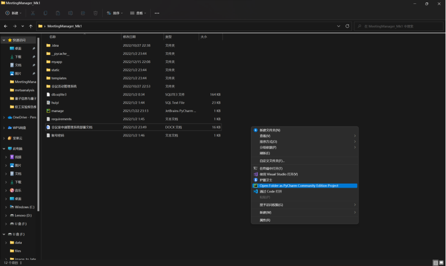

Then, find the file named **manage.py** in project folder, like this:

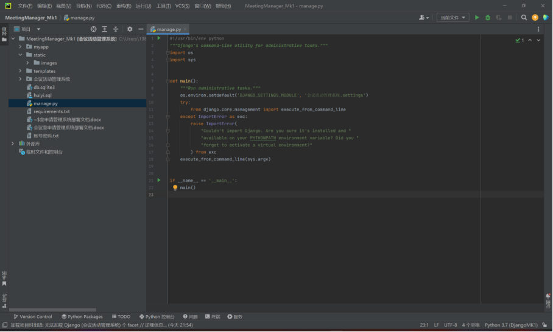

Click **Terminal**, and then choose **Command Prompt**, like this:

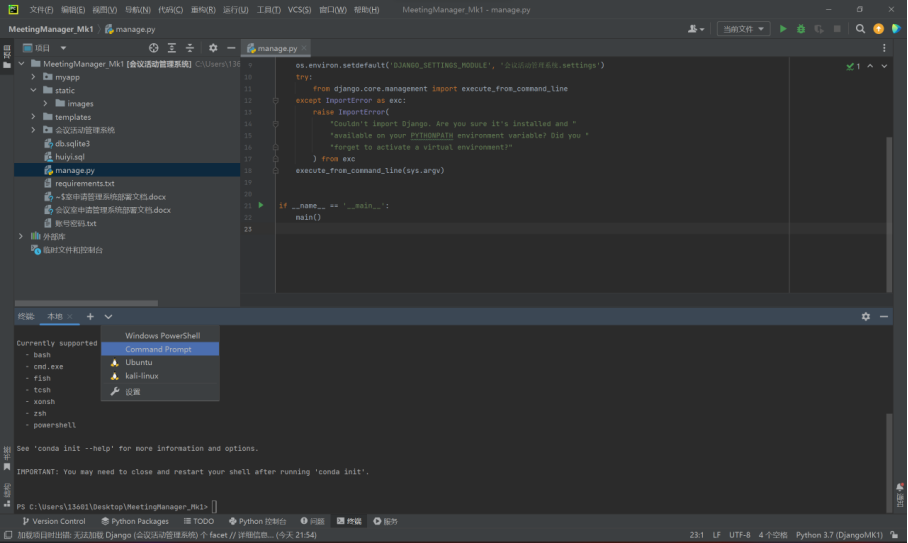

Activate previously created virtual environment **DjangoMK1**, like this:

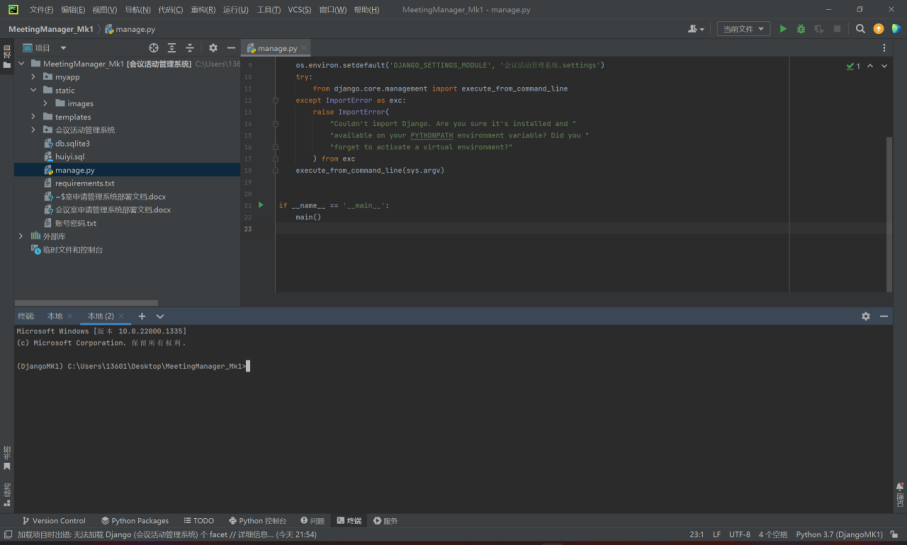

Run command `python manage.py runserver` to run the whole project, like this:

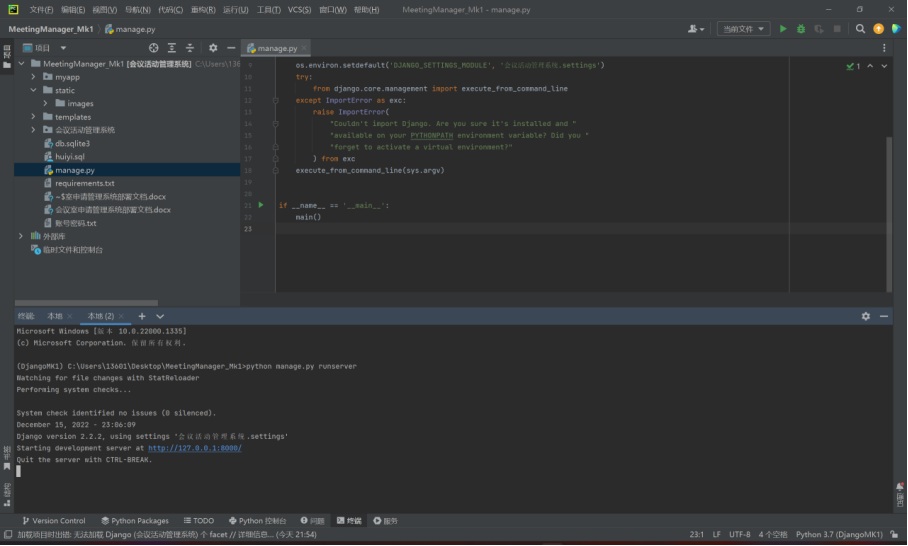

If you cannot get the above output, please double-check whether there is a configuration error, environment collision or software failure. Press **Ctrl** button and **Left Click** the blue URL, you should get the running program like this:

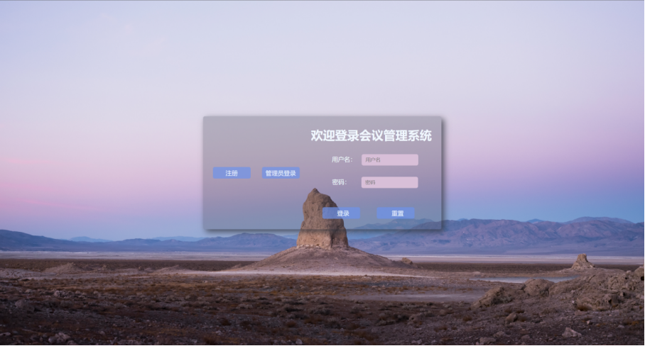

Now, you have successfully build the whole project! Cheers! Here are some additional integrated commands in this program:

| COMMAND                            | DESCRIPTION                                                  |
| ---------------------------------- | ------------------------------------------------------------ |
| check <app_name>                   | check for problems in whole Django program                   |
| diffsettings                       | show difference between current configuration and default    |
| flush                              | delete all data from database                                |
| makemigrations                     | create a new migration based on the detected model           |
| migrate                            | synchronize the database state with the current model set and migration set |
| **runserver <server_address>**     | enable the lightweight development Web server that Django provides us |
| shell                              | launch the Python interactive interpreter with the Django environment |
| startapp <app_name>                | create a new application                                     |
| startproject <project_name>        | create a new project                                         |
| test [test_label [test_label ...]] | run the test code for all installed apps                     |

## How to use this project

In this project we define two kinds of users: **Common Users** and **Administrators**.

### Common Users

For **Common Users**, the available functions are listed below:

#### sign in

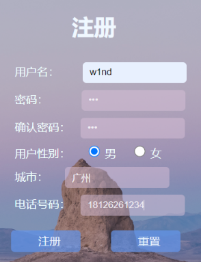

#### log in

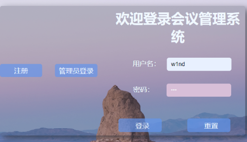

#### get announcement information

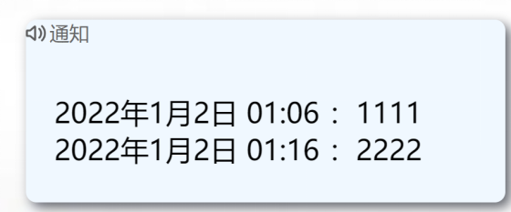

#### modify personal information

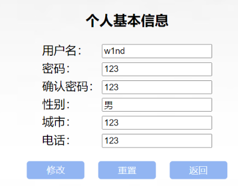

#### get current meeting list and attend meetings

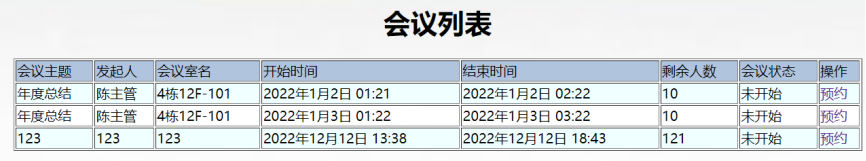

#### search the meetings user attend or initiate

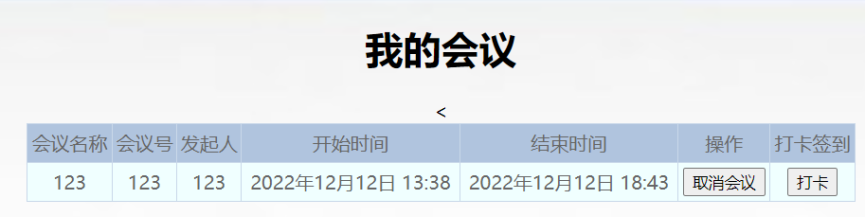

#### initiate a meeting

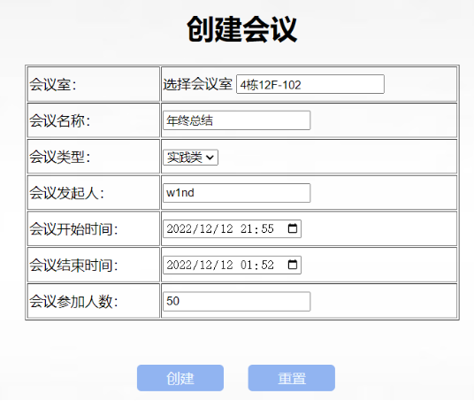

### Administrators

For **Administrators**, the available functions are listed below:

#### log in

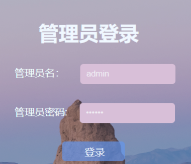

#### make an announcement

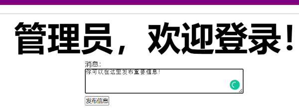

#### manage meetings

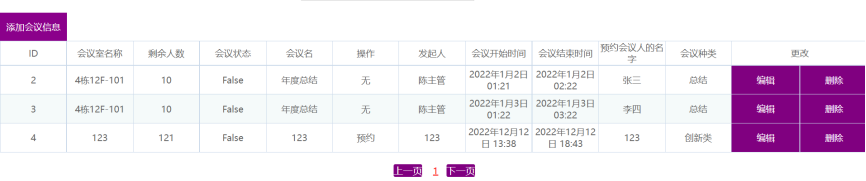

#### manage meeting rooms

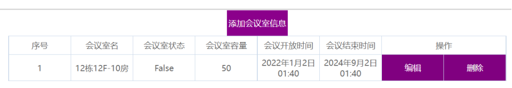

#### manage users

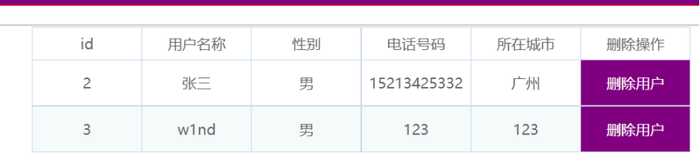

## Further Information

For additional development information, please read the docs and PPT in project file.

Here, we demonstrate some of the designing process of this project:

### Database Interaction

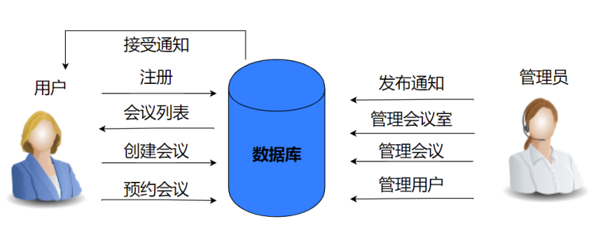

### System Environment Diagram

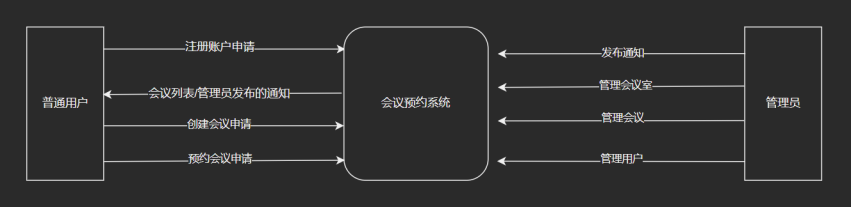

### Level 1 Data Flow Diagram

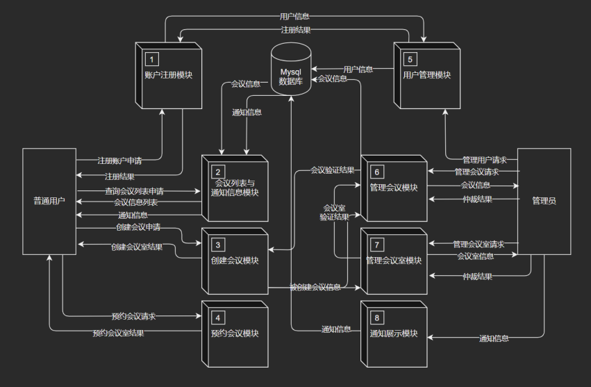

### Entity-Relationship Diagram

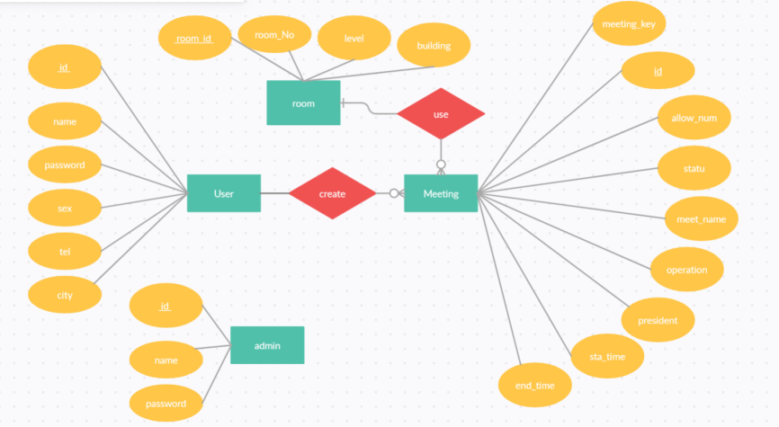

### Module Structure Diagram

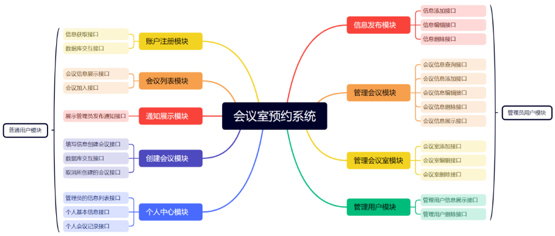
